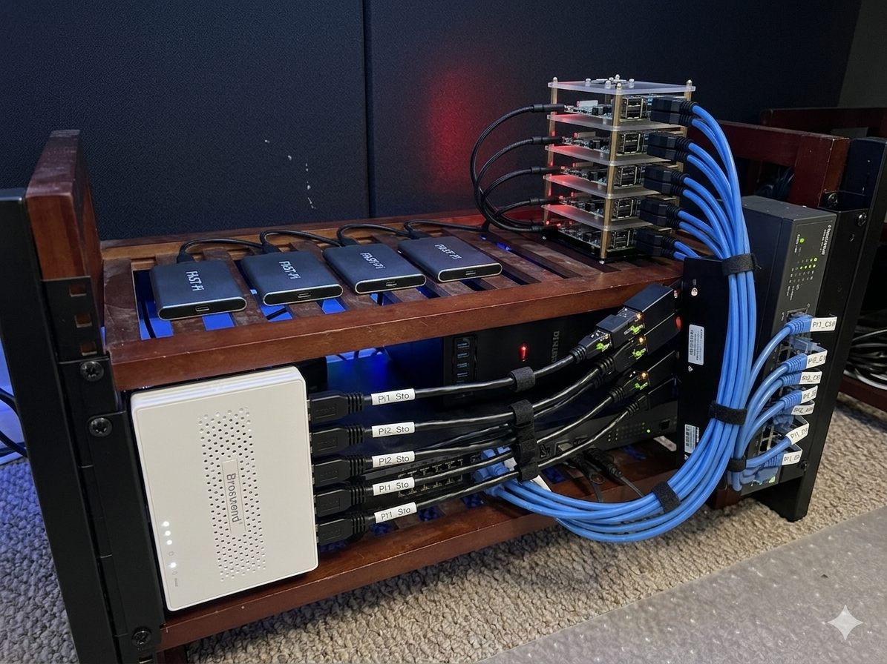

# Raspberry Pi K3s Cluster Setup

Automated deployment of a production-grade K3s cluster on Raspberry Pi 4 devices using Ansible.



## Architecture Overview

This setup creates a resilient Kubernetes cluster with:
- **1 Control Plane Node** (k3s-ctl-01)
- **3 Worker Nodes** (k3s-wrk-1, k3s-wrk-2, k3s-wrk-3)
- **Hybrid Storage Strategy**: OS on SD card, `/var` and high-I/O paths on USB SSD
- **Dual Network**: Primary network for control plane + dedicated storage network (192.168.10.0/24)
- **K3s** with custom CNI (no default Flannel or Traefik)

### Networking Stack
- **Cilium CNI**: Primary networking with eBPF kube-proxy replacement
- **Cilium L2 Announcements**: LoadBalancer IP allocation (192.168.1.200-201)
- **Multus CNI**: Multi-network interface support (thick plugin)
- **Whereabouts IPAM**: IP address management for secondary networks
- **Traefik**: Dual-mode ingress controller (IngressRoute + Gateway API)

### Storage Stack
- **Longhorn**: Distributed block storage on USB SSDs
- **Storage Network**: Dedicated USB Ethernet network for Longhorn replication via bridge CNI
- **Default Storage Class**: Longhorn with replication across nodes

### Observability Stack
- **VictoriaMetrics Single**: Metrics TSDB (PromQL/MetricsQL compatible, ~400MB vs ~1.2GB for kube-prometheus-stack)
- **VMAgent**: Lightweight metrics scraper and remote-writer
- **VictoriaLogs Single**: Log storage backend (LogsQL compatible, Loki-compatible ingest)
- **Fluent Bit**: DaemonSet log collector — tails container logs and forwards to VictoriaLogs
- **Grafana**: Unified dashboards for both metrics and logs

All component versions are pinned in [`group_vars/all.yml`](group_vars/all.yml).

## Quick Start

For those familiar with Ansible and Kubernetes:

```bash
# 1. Setup environment
python3 -m venv .venv && source .venv/bin/activate
pip install -r requirements.txt
ansible-galaxy collection install -r requirements.yml -p ./collections

# 2. Configure inventory
# Edit hosts.ini with your node IPs and MAC addresses

# 3. Deploy cluster (in order)
ansible-playbook 01-infra-prep.yml      # Reboot required
ansible-playbook 02-k3s-install.yml      # Installs K3s
ansible-playbook 03-addons.yml           # Installs networking & storage
ansible-playbook 04-monitoring.yml       # Installs monitoring (optional)

# 4. Use cluster
export KUBECONFIG=~/.kube/config-rpi
kubectl get nodes
```

## Table of Contents

- [Prerequisites](#prerequisites)
- [Initial Setup](#initial-setup)
- [Deployment](#deployment)
- [Verification](#verification)
- [Monitoring](#monitoring)
- [Node Management](#node-management-day-2-operations)
- [Cluster Power Management](#cluster-power-management)
- [Network Architecture](#network-architecture)
- [Troubleshooting](#troubleshooting)
- [Pi Optimisation Notes](#pi-optimisation-notes)
- [Further Reading](#further-reading)
- [License](#license)

## Prerequisites

### Hardware
- 4x Raspberry Pi 4 (8GB RAM recommended)
- 4x 32GB+ SD cards (for OS)
- 4x USB SSDs (for data storage)
- 4x USB Ethernet adapters (for dedicated storage network)
- Network switch and ethernet cables

### Control Node (Ubuntu Desktop/Workstation)
- Ubuntu 22.04 LTS or newer
- Python 3.10+
- Git

### Raspberry Pi Nodes
- Ubuntu Server 24.04 LTS flashed to SD cards
- SSH enabled and configured
- Static IP addresses configured on primary network (192.168.1.41-44)

## Initial Setup

### 1. Clone the Repository

```bash
git clone <repository-url>
cd pi-cluster
```

### 2. Set Up Python Virtual Environment

```bash
sudo apt update && sudo apt install -y python3-venv python3-pip

python3 -m venv .venv
source .venv/bin/activate
```

**Note**: Activate the virtual environment each time you open a new terminal:
```bash
cd pi-cluster && source .venv/bin/activate
```

### 3. Install Python Dependencies

```bash
pip install -r requirements.txt
```

### 4. Install Ansible Collections Locally

```bash
ansible-galaxy collection install -r requirements.yml -p ./collections
```

The `ansible.cfg` file configures Ansible to use the local collections path.

### 5. Install kubectl

```bash
sudo apt-get update && sudo apt-get install -y apt-transport-https ca-certificates curl

curl -fsSL https://pkgs.k8s.io/core:/stable:/v1.29/deb/Release.key | sudo gpg --dearmor -o /etc/apt/keyrings/kubernetes-apt-keyring.gpg

echo 'deb [signed-by=/etc/apt/keyrings/kubernetes-apt-keyring.gpg] https://pkgs.k8s.io/core:/stable:/v1.29/deb/ /' | sudo tee /etc/apt/sources.list.d/kubernetes.list

sudo apt-get update && sudo apt-get install -y kubectl
```

### 6. Install Helm

```bash
curl https://raw.githubusercontent.com/helm/helm/main/scripts/get-helm-3 | bash

# Recommended: install helm-diff so Ansible's helm module reports changes accurately
helm plugin install https://github.com/databus23/helm-diff
```

### 7. Configure Inventory

Edit `hosts.ini` and update:
- IP addresses for your nodes (`ansible_host`)
- Storage network IPs (`storage_ip`)
- **MAC addresses** of your USB Ethernet adapters (`storage_mac`)

Edit `group_vars/all.yml` and update:
- `master_ip` for the K3s API endpoint
- `storage_network_range` if you use a different isolated subnet
- Component versions (`k3s_version`, `cilium_version`, `longhorn_version`, etc.)
- Monitoring defaults (retention, PVC sizes, `grafana_root_url`)

To find MAC addresses on each Pi:
```bash
ssh ubuntu@192.168.1.41
ip link show
# Look for the USB Ethernet adapter (usually not eth0)
```

### 8. Test Connectivity

```bash
ansible -i hosts.ini all -m ping
```

## Project Structure

```
pi-cluster/
├── ansible.cfg               # Ansible configuration
├── requirements.txt          # Python dependencies
├── requirements.yml          # Ansible collection dependencies
├── hosts.ini                 # Inventory file
├── group_vars/all.yml        # Pinned versions and cluster-wide settings
├── 01-infra-prep.yml         # Infrastructure playbook
├── 02-k3s-install.yml        # K3s installation (initial bootstrap only)
├── 03-addons.yml             # Cluster add-ons (Cilium, Multus, Longhorn, Traefik)
├── 04-monitoring.yml         # VictoriaMetrics + VictoriaLogs + Fluent Bit + Grafana
├── k3s-add-worker.yml        # Add worker nodes to existing cluster
├── k3s-remove-worker.yml     # Remove worker nodes from cluster
├── k3s-add-master.yml        # Add master nodes for HA
├── k3s-remove-master.yml     # Remove master nodes from HA cluster
├── cluster-shutdown.yml      # Graceful cluster shutdown
├── cluster-startup.yml       # Cluster startup sequence
├── docs/                     # Operational, design, and troubleshooting docs
├── dashboards/               # Custom Grafana dashboards
├── tests/                    # Kubernetes test manifests
└── scripts/                  # Verification scripts
```

## Deployment

### Step 1: Infrastructure Preparation

Enables cgroups, formats and mounts USB SSDs, offloads `/var` to SSD, configures the dedicated storage network.

```bash
ansible-playbook 01-infra-prep.yml
```

**Note**: Nodes will reboot after this step. Wait 2-3 minutes before proceeding.

### Step 2: K3s Installation

Installs K3s on the control plane with `--flannel-backend=none`, `--disable-kube-proxy`, `--disable servicelb`, and `--disable traefik`. Joins workers and fetches kubeconfig to `~/.kube/config-rpi`.

```bash
ansible-playbook 02-k3s-install.yml
```

**Important**: Nodes will show `NotReady` until Cilium is installed in Step 3. This is expected.

### Step 3: Verify Kubeconfig

```bash
export KUBECONFIG=~/.kube/config-rpi
kubectl get nodes
```

### Step 4: Install Cluster Add-ons

Installs the complete networking and storage stack: Cilium, Multus, Whereabouts, Longhorn, and Traefik.

```bash
ansible-playbook 03-addons.yml
```

This may take 5-10 minutes. Targeted reruns:
```bash
ansible-playbook 03-addons.yml --tags cilium
ansible-playbook 03-addons.yml --tags multus,whereabouts
ansible-playbook 03-addons.yml --tags longhorn
ansible-playbook 03-addons.yml --tags traefik
```

### Step 5: Install Monitoring Stack (Optional)

Lightweight observability stack optimised for Raspberry Pi:
- **VictoriaMetrics Single**: Metrics TSDB (~400MB total vs ~1.2GB for kube-prometheus-stack)
- **VMAgent**: Lightweight metrics scraper
- **VictoriaLogs Single**: Log storage (LogsQL, Loki-compatible ingest)
- **Fluent Bit**: DaemonSet that collects and forwards container logs to VictoriaLogs
- **Grafana**: Unified dashboards for metrics and logs
- **Node Exporter**: Host-level metrics

```bash
ansible-playbook 04-monitoring.yml
```

Targeted reruns:
```bash
ansible-playbook 04-monitoring.yml --tags vmsingle
ansible-playbook 04-monitoring.yml --tags victorialogs
ansible-playbook 04-monitoring.yml --tags vmagent
ansible-playbook 04-monitoring.yml --tags fluent-bit
ansible-playbook 04-monitoring.yml --tags grafana
ansible-playbook 04-monitoring.yml --tags verification
```

## Verification

```bash
export KUBECONFIG=~/.kube/config-rpi

# Check nodes (should all show Ready)
kubectl get nodes -o wide

# Check all pods
kubectl get pods -A

# Check Cilium status
kubectl -n kube-system exec ds/cilium -- cilium status

# Check Longhorn
kubectl -n longhorn-system get pods

# Test LoadBalancer
kubectl -n traefik get svc traefik

# Run full verification sweep
./scripts/verify-cluster.sh
```

### Test Deployments

```bash
kubectl apply -f tests/test-traefik-ingress.yml
curl -H "Host: hello.local" http://192.168.1.200

kubectl apply -f tests/test-gateway-api.yml
curl -H "Host: traefik-gw.local" http://192.168.1.200

kubectl apply -f tests/test-longhorn.yml
kubectl logs longhorn-test-pod
```

## Monitoring

### Access Services

| Service | URL | Notes |
|---------|-----|-------|
| Grafana | http://192.168.1.200/grafana | Default: admin/admin — metrics + logs dashboards |
| VictoriaMetrics | `kubectl port-forward -n monitoring svc/vmsingle-victoria-metrics-single-server 8428:8428` | http://localhost:8428 |
| VictoriaLogs UI | http://192.168.1.200/victorialogs/select/vmui/ | Native VictoriaLogs web UI |
| VictoriaLogs API | `kubectl port-forward -n monitoring svc/vlogs-victoria-logs-single-server 9428:9428` | http://localhost:9428 (direct API access) |
| Hubble UI | `kubectl port-forward -n kube-system svc/hubble-ui 12000:80` | http://localhost:12000 |
| Traefik Dashboard | `kubectl port-forward -n traefik svc/traefik 9000:9000` | http://localhost:9000/dashboard/ |
| Longhorn UI | `kubectl port-forward -n longhorn-system svc/longhorn-frontend 8080:80` | http://localhost:8080 |

### Pi Cluster Stability Notes

This repo now includes a small amount of deliberate "slow cluster" tuning for
Pi-class hardware. The main issue is not that Raspberry Pi 4 nodes are
unusable, but that they have much less headroom for probe storms, PVC attach
latency, and replica rebuild bursts than x86 servers.

In practice the failure pattern on this cluster was:
- a busy worker temporarily stopped responding
- kubelet and CSI operations timed out
- Longhorn volumes briefly went `unknown` or failed to attach
- app readiness checks started failing across unrelated workloads
- Traefik then surfaced those backend flaps as `404` or `502`

The repo now accounts for that by:
- relaxing readiness and liveness probes for Longhorn and the monitoring stack
- adding a `startupProbe` for Grafana
- enabling `nativeLB: true` for the Grafana Traefik `IngressRoute`
- preferring to spread storage-backed monitoring pods across workers
- preparing Longhorn settings that reduce rebuild pressure and gradually correct replica skew

These are not arbitrary delays. They are there because Pi clusters regularly
see short CPU, I/O, and storage-control-plane stalls that would be invisible on
larger hardware but are enough to trip default 1-4 second probes.

### Monitoring Troubleshooting

**Grafana metric panels empty** — separate the problem into three layers:

1. **Exporter layer**: confirm the application exposes metrics
   ```bash
   kubectl exec -n kube-system ds/cilium -- sh -c 'wget -qO- http://127.0.0.1:9962/metrics | head'
   ```

2. **Scrape layer**: confirm VMAgent is discovering and scraping targets
   ```bash
   kubectl logs -n monitoring -l app.kubernetes.io/instance=vmagent --tail=200
   ```

3. **Storage/query layer**: confirm VictoriaMetrics has series
   ```bash
   kubectl port-forward -n monitoring svc/vmsingle-victoria-metrics-single-server 8428:8428
   curl 'http://127.0.0.1:8428/api/v1/label/__name__/values' | grep cilium
   ```

**Grafana log panels empty** — work bottom-up: Fluent Bit → VictoriaLogs → Grafana datasource:

1. **Fluent Bit running?**
   ```bash
   kubectl get pods -n monitoring -l app.kubernetes.io/name=fluent-bit -o wide
   kubectl logs -n monitoring -l app.kubernetes.io/name=fluent-bit --tail=50 | grep -i error
   ```

2. **VictoriaLogs receiving data with `_msg` field?**
   ```bash
   kubectl exec -n monitoring vlogs-victoria-logs-single-server-0 -- \
     wget -qO- 'http://127.0.0.1:9428/select/logsql/query?query=*&limit=1' | grep _msg
   ```
   If `_msg` is absent, the Fluent Bit `Rename log _msg` filter is missing — rerun `--tags fluent-bit`.

3. **Grafana datasource**:  the VictoriaLogs datasource must be provisioned with `uid: victorialogs`
   so that dashboard panel datasource references resolve correctly.

**Grafana `/grafana` path returns `404` or `502`**:

1. **Route exists but Traefik says `404 Not Found`**:
   check Traefik logs for `no servers found for monitoring/grafana`.
   The playbook now sets `nativeLB: true` on the Grafana `IngressRoute`
   because Traefik was intermittently failing to resolve pod backends for the
   `grafana` Service's `80 -> 3000` port translation.

2. **Route exists but returns `502 Bad Gateway`**:
   check whether the Grafana endpoint is flapping.
   ```bash
   kubectl get endpoints,endpointslices -n monitoring | grep grafana
   kubectl describe pod -n monitoring -l app.kubernetes.io/name=grafana
   kubectl logs -n monitoring deploy/grafana --tail=100
   ```
   On this cluster the chart default readiness timing was too aggressive, so
   the repo now gives Grafana a wider readiness budget plus a `startupProbe`.

3. **If Grafana itself is healthy but mounts fail**:
   stop treating it as an ingress problem and move down to Longhorn / node
   health. A missing `driver.longhorn.io/csi.sock`, `FailedMount`, or
   `FailedAttachVolume` event points to storage control-plane instability.

### Adding New Dashboards

See [`dashboards/README.md`](dashboards/README.md) for the custom dashboard workflow. The pattern: create JSON in `dashboards/`, create a matching ConfigMap manifest, apply from `04-monitoring.yml`.

## Node Management (Day-2 Operations)

After initial cluster deployment, use dedicated playbooks for node changes. **Do not re-run `02-k3s-install.yml`** on a live cluster.

### Adding a New Worker

```bash
# 1. Add the node to hosts.ini under [workers]
# 2. Prepare infrastructure
ansible-playbook 01-infra-prep.yml --limit k3s-wrk-05
# 3. Join the node
ansible-playbook k3s-add-worker.yml --limit k3s-wrk-05
```

### Removing a Worker

```bash
ansible-playbook k3s-remove-worker.yml --limit k3s-wrk-05
# With data wipe:
ansible-playbook k3s-remove-worker.yml --limit k3s-wrk-05 -e wipe_data=true
```

### Scaling to HA (Adding Master Nodes)

```bash
ansible-playbook 01-infra-prep.yml --limit k3s-ctl-02
# Add masters ONE AT A TIME (important for etcd stability)
ansible-playbook k3s-add-master.yml --limit k3s-ctl-02
```

### Removing a Master

```bash
ansible-playbook k3s-remove-master.yml --limit k3s-ctl-03
```

All node management playbooks require `--limit` to prevent accidental runs against all nodes.

## Cluster Power Management

### Shutdown

Safely shuts down workers first, then control plane:
```bash
ansible-playbook cluster-shutdown.yml
```

### Startup

After powering on nodes:
```bash
ansible-playbook cluster-startup.yml
```

## Network Architecture

- **Primary Network (eth0)**: 192.168.1.0/24 — control plane, application traffic, Cilium overlay
- **Storage Network (br-storage)**: 192.168.10.0/24 — Longhorn replication and iSCSI traffic via USB Ethernet adapters, isolated from application traffic, using bridge CNI with Whereabouts IPAM

See [`docs/OPERATIONS.md`](docs/OPERATIONS.md) for the full storage network deep dive including the packet data path and failure modes.

## Troubleshooting

### Quick Checks

```bash
# Pods stuck in Pending
kubectl describe pod <pod-name>
kubectl describe nodes

# Longhorn volumes not mounting
kubectl -n longhorn-system logs -l app=longhorn-manager
kubectl get network-attachment-definitions -n longhorn-system

# Cilium issues
kubectl -n kube-system exec ds/cilium -- cilium status

# Worker join errors: "Node password rejected"
# Use k3s-add-worker.yml which handles stale state automatically

# Time out-of-sync
systemctl status systemd-timesyncd
```

For detailed diagnosis commands per component, see [`docs/TROUBLESHOOTING.md`](docs/TROUBLESHOOTING.md).
For recovery procedures, see [`docs/RUNBOOKS.md`](docs/RUNBOOKS.md).

## Pi Optimisation Notes

- Prefer one control plane plus three workers unless you truly need HA etcd. On four Raspberry Pi 4 nodes, a single control plane leaves more RAM and CPU for workloads.
- Keep VictoriaMetrics retention short and dashboard count lean. Monitoring is one of the fastest ways to consume RAM on 8GB Pis.
- Consider disabling Hubble UI when not actively troubleshooting. The relay/UI pair is useful but not free on small ARM nodes.
- If Longhorn replica rebuild traffic saturates the cluster, set replica count per workload rather than using a high default.
- This repo sets Longhorn's default replica count to `2` for new volumes and
  creates a dedicated `longhorn-rpi` StorageClass for repo-managed PVCs. That
  is a conscious tradeoff for Pi hardware: less write amplification and rebuild
  pressure, but lower fault tolerance than `3`. Existing Longhorn volumes keep
  their current replica count until recreated or changed explicitly.
- Use dedicated namespaces with explicit resource requests/limits for every add-on. Noisy-neighbor effects show up quickly on Pi hardware.
- Expect default Kubernetes and Helm chart probes to be too optimistic. Many charts assume x86 SSD-backed nodes and treat 1-second health checks as normal; on Pi clusters that often creates false failures.
- Tune readiness before liveness. A slow response should usually remove a pod from service first, not restart it immediately.
- Separate replica spread from attached-volume ownership. Longhorn can have correctly distributed replicas while a single worker still carries too many active volume attachments.
- Keep Longhorn rebuild concurrency low. Rebuild storms are expensive on USB SSD + SBC clusters and can amplify node stalls.
- Use the helper scripts after any change:
  - `./scripts/analyze-probe-pressure.sh`
  - `./scripts/analyze-node-pressure.sh <node>`
  - `./scripts/analyze-longhorn-replicas.sh`

## Architecture Notes

- **Single control plane node** — suitable for homelabs, not production HA
- All Kubernetes data is stored on `/mnt/ssd/k3s` to protect SD cards from wear
- The full `/var` tree is bind-mounted from `/mnt/ssd/var`
- Longhorn uses `/mnt/ssd/longhorn` for volume storage

## Further Reading

| Document | Purpose |
|----------|---------|
| [`docs/OPERATIONS.md`](docs/OPERATIONS.md) | Component dependency chain, networking deep dive, safe rerun patterns |
| [`docs/TROUBLESHOOTING.md`](docs/TROUBLESHOOTING.md) | Diagnosis commands per component |
| [`docs/RUNBOOKS.md`](docs/RUNBOOKS.md) | Recovery procedures for common failures |
| [`docs/UPGRADING.md`](docs/UPGRADING.md) | K3s, Cilium, Longhorn, Multus upgrade procedures |
| [`docs/MAINTENANCE.md`](docs/MAINTENANCE.md) | etcd backup/restore, SD/SSD health checks |
| [`docs/DESIGN.md`](docs/DESIGN.md) | Architecture decisions and rationale |
| [`dashboards/README.md`](dashboards/README.md) | Custom Grafana dashboard workflow |
| [`scripts/README.md`](scripts/README.md) | Verification script usage |

If you need to move existing monitoring PVCs to the new `longhorn-rpi`
StorageClass or reduce old Longhorn volumes from 3 replicas to 2 in place, use
the runbook in [`docs/RUNBOOKS.md`](docs/RUNBOOKS.md).

## References

- [K3s Documentation](https://docs.k3s.io/)
- [Cilium Documentation](https://docs.cilium.io/)
- [Longhorn Documentation](https://longhorn.io/docs/)
- [Multus CNI](https://github.com/k8snetworkplumbingwg/multus-cni)

## License

This project is licensed under the MIT License — see the [LICENSE](LICENSE) file for details.

---

> This repository was created with the assistance of AI (Claude by Anthropic).
