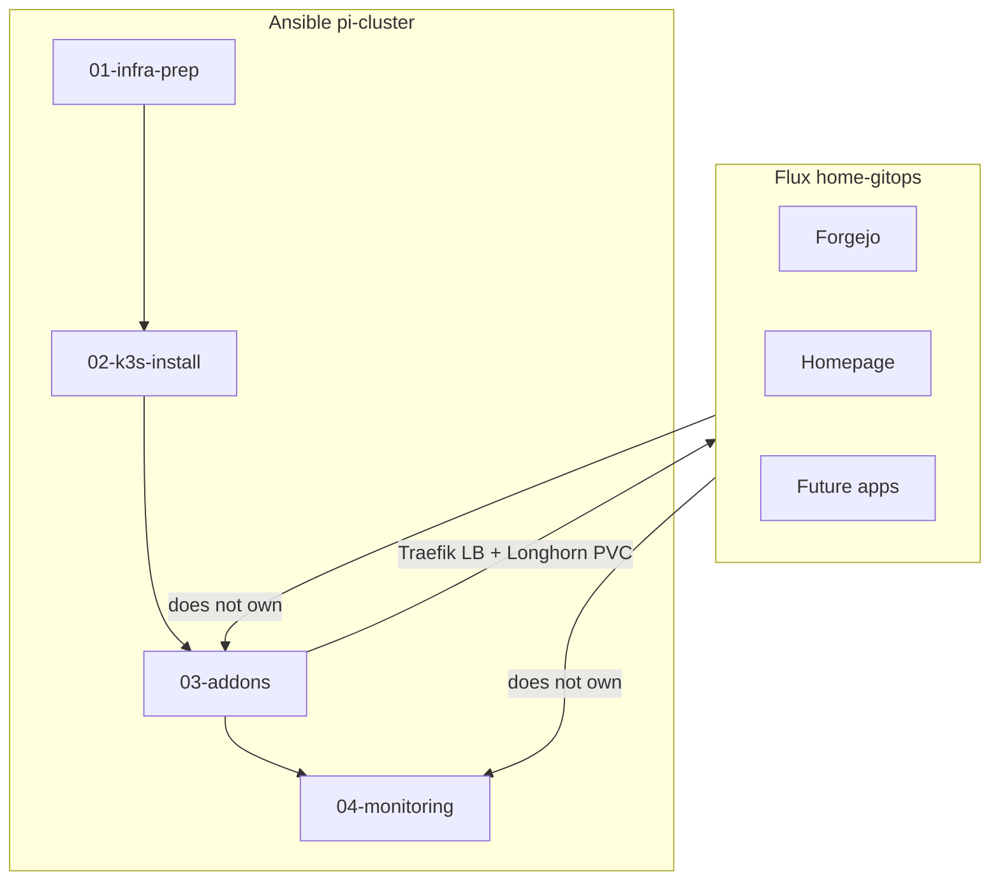
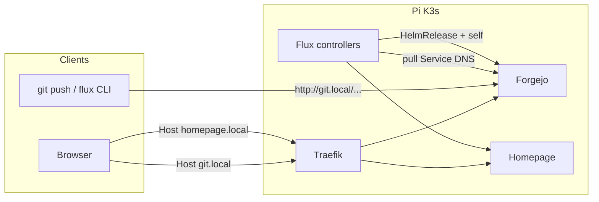
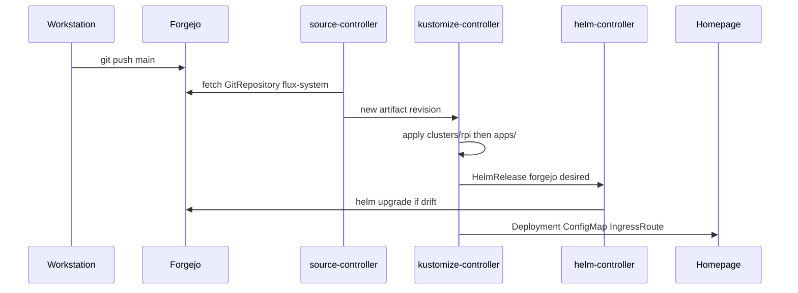

# GitOps (Flux) on the Pi Cluster

Application delivery is managed by **Flux CD** from a separate repo hosted on in-cluster **Forgejo**. Infrastructure layers stay in this Ansible repo (`pi-cluster`).

This document explains **what** is deployed, **why** those choices were made, and **how** traffic / reconcile paths work. Day-2 commands for the app repo live in `~/PROJECTS/home-gitops/README.md`.

## Why this shape

Push-based Ansible is a poor fit for apps: Helm state on the workstation drifts, `become_ask_pass` blocks unattended runs, and imperative `kubectl` tweaks are invisible later. The best-practices review ([BEST-PRACTICES-REVIEW-2026-07.md](BEST-PRACTICES-REVIEW-2026-07.md)) recommended Flux as Phase 2 delivery (~150 MiB) while keeping playbooks 01–02 for host/K3s.

We deliberately **start with apps only**:

- Multus privileged patches, SSD systemd drop-ins, and Cilium/Longhorn Helm values are battle-tested in Ansible — moving them into Flux too early couples GitOps to host-recovery paths.
- Forgejo + Homepage are self-contained workloads with clear IngressRoutes; they are a low-risk first GitOps surface.
- Traefik / Longhorn / monitoring stay Ansible until backups and a rebuild path are solid. Do **not** re-run `02-k3s-install.yml` for app work.

## Boundary

| Layer | Owner | Repo / playbook |
|-------|-------|-----------------|
| Host prep, SSD, `br-storage` | Ansible | `01-infra-prep.yml` |
| K3s | Ansible | `02-k3s-install.yml` |
| Cilium, Multus, Whereabouts, Longhorn, Traefik | Ansible | `03-addons.yml` |
| VictoriaMetrics, VictoriaLogs, Fluent Bit, Grafana, alerting | Ansible | `04-monitoring.yml` |
| Forgejo, Homepage, future apps | Flux | `~/PROJECTS/home-gitops` → Forgejo `git/home-gitops` |



## Architecture

Cilium L2 announces Traefik at `192.168.1.200`. Host-based routes (`git.local`, `homepage.local`) match the proven pattern in [tests/test-traefik-ingress.yml](../tests/test-traefik-ingress.yml). Path-based Grafana/VictoriaLogs (`/grafana`, `/victorialogs`) remain on the same VIP for Ansible-managed UIs.



### Reconcile loop



Flux watches `./clusters/rpi` (bootstrapped `flux-system` + `apps.yaml`). The `apps` Kustomization applies `./apps` (Forgejo + Homepage). Prune is enabled so deleting a manifest from git removes it from the cluster.

## Design choices (why)

| Choice | Decision | Why |
|--------|----------|-----|
| Git host | **Forgejo** (not Gitea/GitHub) | Lightweight community forge; runs on Pi-class hardware; keeps GitOps source on-LAN when the internet or GitHub is down |
| GitOps repo | Separate `home-gitops` | Keeps app intent out of the Ansible tree; Flux can reconcile without sudo/Ansible |
| Forgejo chart | OCI `oci://code.forgejo.org/forgejo-helm/forgejo` 17.x | Official chart; chart Ingress disabled — we own Traefik `IngressRoute` like the rest of the cluster |
| Homepage deploy | Official manifests + Kustomize | Upstream has no official Helm chart; unofficial charts add drift; ConfigMap + per-file `subPath` mounts match [gethomepage k8s docs](https://gethomepage.dev/installation/k8s/) |
| Homepage image | Pinned `ghcr.io/gethomepage/homepage:v1.13.2` | Avoid `:latest` surprise upgrades on Pi |
| Ingress | Traefik `IngressRoute` + `Host(...)` | Same pattern as `hello.local` tests; `nativeLB: true` avoids Traefik port-translation “no servers” issues seen with Grafana |
| DNS | `/etc/hosts` → `192.168.1.200` | No cluster DNS for client laptops; no TLS/cert-manager yet (matches HTTP Grafana) |
| Forgejo DB | **SQLite**, single replica | See [below](#forgejo-database-sqlite) |
| Flux Git URL | In-cluster Service DNS | See [below](#two-git-urls-why) |
| Secrets | Out of git (`~/.config/home-gitops/`, K8s Secrets) | SOPS can come later; admin password and Flux token must not land in ConfigMaps |

### Forgejo database: SQLite

Forgejo runs with built-in **SQLite**, not Postgres:

- **Config:** `gitea.config.database.DB_TYPE: sqlite3` in `home-gitops/apps/forgejo/helmrelease.yaml`
- **Topology:** `replicaCount: 1` and `strategy.type: Recreate` — one writer, no multi-pod Forgejo
- **Persistence:** chart PVC on `storageClass: longhorn-rpi`, size `10Gi` — SQLite file and git repository data share that volume

**Why SQLite for this cluster**

- Pi-class nodes: the Forgejo Helm chart’s bundled Postgres/Redis (or HA) dependencies are a large RAM/CPU and operational cost for a home forge
- Forgejo’s own single-pod chart docs endorse built-in SQLite when HA is not required
- Home-lab git volume is modest; Longhorn already protects the PVC with replicas at the storage layer

**Tradeoffs**

- No HA database — Forgejo is unavailable while the pod is rescheduled or the RWO volume reattaches
- Not suitable for multi-writer / multi-replica Forgejo
- Acceptable for private GitOps source + light interactive use

**When to revisit**

Move to external Postgres (in-cluster or on a standalone VM) if concurrency, finer backup granularity, or multi-replica Forgejo becomes a goal. That is a Helm values change plus a data migration — not a change to the Flux/GitOps architecture.

### Two Git URLs (why)

| Who | URL | Why |
|-----|-----|-----|
| Humans | `http://git.local/git/home-gitops.git` | Friendly hostname via Traefik + `/etc/hosts` |
| Flux controllers | `http://forgejo-http.forgejo.svc.cluster.local:3000/git/home-gitops.git` | Controllers run **inside** the cluster; CoreDNS does not read workstation `/etc/hosts`, and `127.0.0.1` from bootstrap port-forward is unreachable from pods |

Bootstrap used a workstation port-forward (`127.0.0.1:33000`) so `flux bootstrap git` could push manifests before `/etc/hosts` existed. Immediately afterward, `clusters/rpi/flux-system/gotk-sync.yaml` was pointed at the Service DNS so the self-managing `flux-system` Kustomization does not revert the URL.

### Chicken-and-egg (why the bootstrap order)

Forgejo hosts the repo Flux pulls. If Flux alone created Forgejo from an empty remote, there would be nothing to pull. Order:

1. Ansible ensures Longhorn + Traefik.
2. Imperative Helm install of Forgejo (once) + admin Secret + IngressRoute.
3. Create `git/home-gitops`, push app manifests.
4. `flux bootstrap git` installs controllers and writes `flux-system/` into the repo.
5. Commit Forgejo as a HelmRelease with the **same** release name/namespace so Flux adopts the running install (no second copy).
6. Homepage lands via the `apps` Kustomization.

After that, both Forgejo and Homepage are desired state in git. The imperative Helm install is only a bootstrap scaffold.

### Homepage probe Host header (why)

gethomepage v1+ requires `HOMEPAGE_ALLOWED_HOSTS`. kubelet probes hit the pod IP without that Host, so healthchecks returned **HTTP 400** and Flux `wait: true` never became Ready. Liveness/readiness probes send `Host: homepage.local`. Do not remove those headers.

Config files mount with **per-file `subPath`** plus `emptyDir` for `/app/config/logs`. Mounting the whole ConfigMap read-only on `/app/config` breaks the app’s log directory / skeleton behaviour.

## Access

Add to `/etc/hosts` on clients:

```
192.168.1.200 git.local homepage.local
```

| Service | URL | Owner |
|---------|-----|-------|
| Forgejo | http://git.local | Flux |
| Homepage | http://homepage.local | Flux |
| Grafana | http://192.168.1.200/grafana | Ansible |
| VictoriaLogs UI | http://192.168.1.200/victorialogs/select/vmui/ | Ansible |

Workstation secrets: `~/.config/home-gitops/` (`forgejo-admin.env`, `forgejo-token`) — never commit them. Prefer a credential helper over embedding the token in `git remote` URLs.

Without `/etc/hosts`, debug with:

```bash
curl -H 'Host: homepage.local' http://192.168.1.200/api/healthcheck
curl -H 'Host: git.local' -o /dev/null -w '%{http_code}\n' http://192.168.1.200/
kubectl -n forgejo port-forward svc/forgejo-http 33000:3000
```

## Repo layout (`home-gitops`)

```
home-gitops/
  clusters/rpi/
    flux-system/           # flux bootstrap (gotk-components, gotk-sync)
    apps.yaml              # Flux Kustomization → ./apps
    kustomization.yaml     # resources: [flux-system, apps.yaml]
  apps/
    kustomization.yaml
    forgejo/               # HelmRepository (OCI), HelmRelease, IngressRoute
    homepage/              # Deployment, ConfigMap, RBAC, Service, IngressRoute
  README.md
```

- `clusters/rpi` is the Flux sync path (`GitRepository` + root Kustomization).
- `apps.yaml` is a Flux `Kustomization` CR (API `kustomize.toolkit.fluxcd.io`), not a kustomize build file — it tells Flux to apply `./apps` with prune/wait.
- Forgejo admin Secret is created out-of-band; see `apps/forgejo/admin-secret.hint.md`.

## Day-2 app changes

```bash
export KUBECONFIG=~/.kube/config-rpi
export PATH="$HOME/.local/bin:$PATH"

cd ~/PROJECTS/home-gitops
# edit apps/... then commit and push to Forgejo (http://git.local/git/home-gitops.git)

flux reconcile source git flux-system
flux reconcile kustomization apps
flux get all -A
```

Homepage UI config is `apps/homepage/configmap.yaml`. After a config-only change, bump the Deployment `checksum/config` annotation (or any pod-template field) so pods remount the ConfigMap files.

## Bootstrap / disaster recovery

1. Ensure Longhorn + Traefik are healthy (Ansible 01–03).
2. Create `forgejo` namespace + `forgejo-admin` Secret (`home-gitops/apps/forgejo/admin-secret.hint.md`).
3. Helm-install Forgejo with values matching `apps/forgejo/helmrelease.yaml`; apply `git.local` IngressRoute.
4. Restore or recreate `git/home-gitops` on Forgejo; push `main`.
5. `flux bootstrap git` (port-forward if needed), then set `gotk-sync.yaml` GitRepository URL to the **in-cluster** Service DNS.
6. Flux adopts Forgejo and deploys Homepage from `./apps`.

## Related

- `~/PROJECTS/home-gitops/README.md` — short operator cheat sheet
- [OPERATIONS.md](OPERATIONS.md) — Ansible component dependency chain
- [BEST-PRACTICES-REVIEW-2026-07.md](BEST-PRACTICES-REVIEW-2026-07.md) — Flux as Phase 2 (apps-first; infra migration still future)
- [tests/test-traefik-ingress.yml](../tests/test-traefik-ingress.yml) — host-based IngressRoute reference
