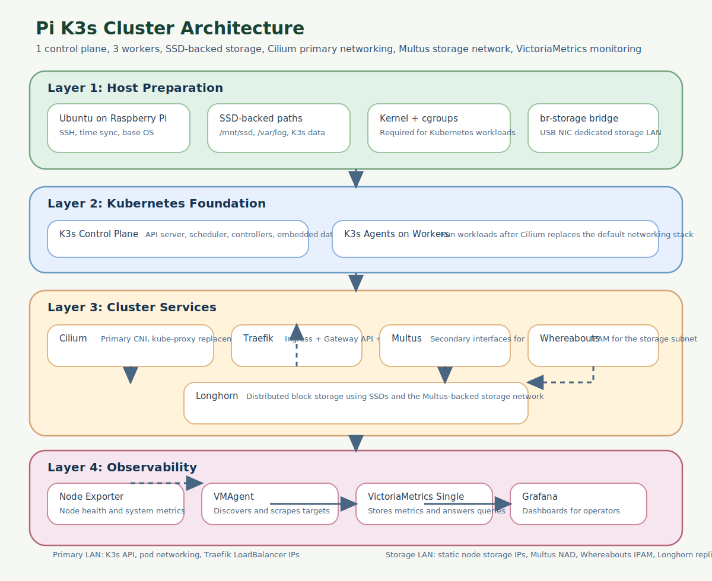
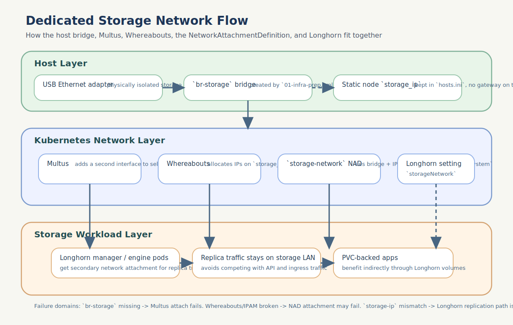

# Pi K3s Cluster - Operations Guide

This guide explains how the cluster is assembled, how the major components
interrelate, and which layer to inspect first when something is not behaving.
It is meant to sit between the step-by-step deployment instructions in
`../README.md` and the command-focused reference in `TROUBLESHOOTING.md`.



## Mental Model

Think of the cluster as four stacked layers:

1. Host preparation: Ubuntu, SSD mounts, SSD-backed `/var`, cgroups, and the dedicated
   `br-storage` bridge all need to exist before Kubernetes can work reliably.
2. Kubernetes control plane: K3s provides the API server, schedules workloads,
   and stores cluster state on SSD-backed storage.
3. Cluster services: Cilium, Multus, Whereabouts, Longhorn, and Traefik extend
   the cluster with networking, storage, and ingress behavior.
4. Observability: VictoriaMetrics, VMAgent, Node Exporter, and Grafana make it
   possible to see whether the lower layers are healthy.

If a higher layer is broken, start by checking the layer immediately below it.
For example, if Grafana is empty, verify VMAgent and VictoriaMetrics before
debugging dashboards. If Longhorn cannot attach volumes, verify Multus,
Whereabouts, and the dedicated storage network before debugging Longhorn
itself.

## Deployment Flow

### 1. `01-infra-prep.yml`

This playbook prepares the host OS for Kubernetes and storage-heavy workloads.

What it establishes:
- cgroups required by Kubernetes on Raspberry Pi Ubuntu nodes
- `/mnt/ssd` as the durable location for write-heavy paths
- the full `/var` tree moved off SD card to reduce flash wear
- `br-storage` created from the USB NIC on each node

Why it matters:
- K3s and Longhorn both behave much better when their heavy write paths live on
  SSD rather than SD card.
- The dedicated bridge has to exist before Multus and Longhorn can use it.

### 2. `02-k3s-install.yml`

This playbook installs K3s with the default networking stack disabled.

What it establishes:
- a control plane on the controller node
- worker joins on the three worker nodes
- kubeconfig copied to the control machine
- default Flannel, kube-proxy, servicelb, and Traefik disabled

Why it matters:
- Cilium replaces the default K3s networking pieces, so the cluster will look
  incomplete until the add-ons playbook runs.
- Nodes being `NotReady` immediately after K3s install is expected until Cilium
  is deployed.

### 3. `03-addons.yml`

This playbook turns a bare K3s cluster into a usable platform.

What it establishes:
- Cilium as the primary CNI and kube-proxy replacement
- Cilium L2 announcements for `LoadBalancer` services on the LAN
- Multus for secondary network attachments
- Whereabouts for secondary network IP allocation
- Longhorn for distributed storage on the SSDs
- Traefik for ingress and Gateway API support

Why order matters:
- Cilium must be healthy before most other workloads can schedule normally.
- Multus and Whereabouts depend on the host bridge from `01-infra-prep.yml`.
- Longhorn depends on the `storage-network` NAD and node `storage-ip`
  annotations to keep replication traffic on the dedicated network.
- Traefik depends on Cilium L2 to receive a stable external IP.

### 4. `04-monitoring.yml`

This playbook adds observability after the platform is already functioning.

What it establishes:
- Node Exporter for node-level metrics
- VictoriaMetrics Single as the metrics store
- VMAgent as the scraper and remote-writer
- Grafana dashboards and ingress

Why it comes last:
- Monitoring is easiest to debug after networking, storage, and ingress are
  already known-good.
- Grafana can only help if the cluster can already schedule pods and expose
  services.

## Normal Vs Suspicious During Deployment

### After `01-infra-prep.yml`

Normal:
- nodes reboot once after kernel and mount changes
- SSD mount creation takes a little time on Pi hardware
- `br-storage` exists even before Kubernetes is installed

Suspicious:
- `/mnt/ssd` is missing after reboot
- `/var` is still on the SD card
- `br-storage` does not exist on one or more nodes

### After `02-k3s-install.yml`

Normal:
- `k3s` and `k3s-agent` services are active
- the control plane responds to `kubectl`
- nodes may still be `NotReady` because Cilium is not installed yet

Suspicious:
- the API server is unreachable from the control machine
- `k3s-agent` is active but a worker never progresses beyond `NotReady`
- kubeconfig still points to `127.0.0.1` instead of the controller IP

### During `03-addons.yml`

Normal:
- Cilium takes some time to roll out on all nodes
- Longhorn takes a while to settle on small ARM hardware
- Traefik gets an external IP only after Cilium L2 is ready

Suspicious:
- new pods across namespaces start failing with `FailedCreatePodSandBox`
- Traefik never receives a `LoadBalancer` IP
- Longhorn managers stay unhealthy or volumes cannot attach after the storage
  network has supposedly been configured

### During `04-monitoring.yml`

Normal:
- `vmagent` may take a short while to show full target discovery
- dashboards can stay sparse until traffic exists
- Hubble-specific metrics can remain empty until matching flows occur

Suspicious:
- `vmagent` is repeatedly `OOMKilled`
- VictoriaMetrics is ready but expected series never appear
- Grafana is up but every dashboard remains empty even though smoke tests pass

## Component Relationships

### K3s

K3s is the foundation. It provides:
- API server
- scheduler
- controller manager
- kubelet and container runtime integration

Everything else in the repo is a workload or extension running on top of K3s.
If K3s is unhealthy, debug that first.

### Cilium

Cilium is the primary cluster network.

Responsibilities:
- pod-to-pod networking on the main LAN
- service handling without kube-proxy
- `LoadBalancer` IP advertisement through L2 announcements
- Hubble telemetry

Dependencies:
- healthy K3s control plane

Things that depend on Cilium:
- nearly every pod in the cluster
- Traefik external access
- observability for Cilium/Hubble dashboards

### Multus

Multus is a meta-plugin that allows selected pods to have more than one network
interface.

Responsibilities:
- attach a secondary interface in addition to the primary Cilium interface

Dependencies:
- healthy primary CNI
- host-side `br-storage` created in `01-infra-prep.yml`

Things that depend on Multus:
- Longhorn storage-network integration
- any future workload that needs a secondary interface

### Whereabouts

Whereabouts is IPAM for Multus-managed secondary networks.

Responsibilities:
- allocate addresses on the storage subnet
- avoid reusing reserved addresses
- exclude the statically assigned node `storage_ip` values from inventory

Dependencies:
- Multus
- valid storage subnet configuration in `group_vars/all.yml`

Things that depend on Whereabouts:
- the `storage-network` NetworkAttachmentDefinition
- any pod using the storage network

### Longhorn

Longhorn provides distributed block storage.

Responsibilities:
- persistent volumes
- replica scheduling across nodes
- volume attachment and rebuild
- using the storage network for replica traffic

Dependencies:
- SSD mounts from `01-infra-prep.yml`
- working cluster networking from Cilium
- working secondary network path from Multus and Whereabouts
- node `storage-ip` annotations
- worker nodes available for replica scheduling

Operational policy:
- the control-plane node is reserved for Kubernetes and cluster-service work
- Longhorn storage scheduling is worker-only in this repo
- the add-ons playbook patches any control-plane Longhorn node to
  `allowScheduling: false` so the policy stays explicit after redeploys
- the add-ons playbook also labels worker nodes and applies that label to
  Longhorn's user-managed and system-managed components so CSI controllers do
  not drift onto the control plane on fresh installs
- in practice, controller deployments such as `csi-attacher`,
  `csi-provisioner`, `csi-resizer`, and `csi-snapshotter` should end up on
  workers, while the `longhorn-csi-plugin` DaemonSet may still appear on the
  control node unless you choose to enforce a stricter no-Longhorn-components
  rule there

Things that depend on Longhorn:
- VictoriaMetrics PVC
- Grafana PVC
- any stateful workload using the default storage class

### Traefik

Traefik handles ingress for applications and dashboards.

Responsibilities:
- `IngressRoute` and Gateway API routing
- exposing Grafana and any sample/test workloads
- exporting ingress metrics

Dependencies:
- Cilium L2 for `LoadBalancer` IP assignment
- healthy Service and Endpoint plumbing in Kubernetes

Things that depend on Traefik:
- operator access to Grafana over HTTP
- test ingress manifests

### VictoriaMetrics Stack

The monitoring stack has three distinct roles:

- Node Exporter: exports node metrics
- VMAgent: discovers and scrapes targets
- VictoriaMetrics Single: stores metrics and answers queries
- Grafana: renders dashboards against VictoriaMetrics

Dependencies:
- working pod scheduling
- working storage for `vmsingle` and Grafana
- working internal service networking

Important relationship:
- Empty Grafana panels do not automatically mean exporters are broken. The
  issue can be at the exporter, scrape, storage, query, or dashboard layer.

## Networking Model

### Primary Network

This is the normal cluster network on `192.168.1.x`.

Used for:
- SSH
- Kubernetes API
- pod primary interfaces
- `LoadBalancer` IPs from Cilium
- ingress traffic through Traefik

### Dedicated Storage Network

This is the isolated storage subnet, currently `192.168.10.0/24`.

Used for:
- Longhorn replica traffic
- storage-specific secondary interfaces



Important details:
- the nodes themselves use statically assigned `storage_ip` values from
  `hosts.ini`
- there is no storage gateway in this design
- Whereabouts allocates from the subnet but excludes the static node addresses

### How the Storage Network Actually Works (Deep Dive)

The storage network exists so that Longhorn replication data — which can be
large and bursty — never competes with application traffic, SSH, or the
Kubernetes API on the primary `192.168.1.x` network. Achieving this requires
five components to cooperate in a precise chain. Understanding each component
and how they connect is essential for debugging.

#### Physical layer: USB NICs and `br-storage`

Each Raspberry Pi has a USB Ethernet adapter plugged in, dedicated to storage
traffic. These adapters are identified by MAC address in `hosts.ini`:

```ini
k3s-wrk-01 ansible_host=192.168.1.42 storage_ip=192.168.10.42 storage_mac=78:32:1b:a8:a4:c9
```

`01-infra-prep.yml` uses Netplan to create a Linux bridge called `br-storage`
on every node. The USB NIC is enslaved to this bridge, and the bridge itself
gets the node's static `storage_ip` address (e.g. `192.168.10.42/24`). This
bridge exists at the OS level before Kubernetes is even installed.

Why a bridge instead of using the USB NIC directly: Multus needs a stable,
predictable interface name to reference in the NetworkAttachmentDefinition.
USB NICs get names like `enx7832...` that vary per adapter. The bridge
normalises this to `br-storage` on every node.

At this point, the nodes can already ping each other on `192.168.10.x` — the
bridge is a regular Linux network interface with a static IP.

#### Cilium: primary CNI with Multus coexistence

Cilium is the primary CNI and kube-proxy replacement. It handles all normal
pod-to-pod traffic on the `192.168.1.x` network, service routing, and
`LoadBalancer` IP advertisement via L2 ARP announcements.

By default, Cilium operates in exclusive mode: it renames any non-Cilium CNI
configuration files (like `00-multus.conf`) to `.cilium_bak`, which would
silently break Multus. The playbook sets `cni.exclusive: false` in the Cilium
Helm values to prevent this.

With `cni.exclusive: false`:
- Cilium still handles all primary pod networking
- Multus's `00-multus.conf` is left intact on disk
- Pods that do not request a secondary network are unaffected
- Pods that do request one get their primary interface from Cilium and an
  additional interface from Multus

#### Multus: adding a second interface to selected pods

Multus is a CNI meta-plugin. It does not provide networking itself. Instead, it
delegates: the primary interface to Cilium, and secondary interfaces to other
CNI plugins (in this case, the bridge plugin).

Multus runs as a DaemonSet (`kube-multus-ds`) using the thick plugin
deployment, which means the Multus daemon on each node handles CNI calls
directly rather than relying on a thin shim binary.

How a pod gets a second interface:
1. A pod's spec includes a `k8s.v1.cni.cncf.io/networks` annotation
   referencing a NetworkAttachmentDefinition (NAD).
2. The kubelet calls the CNI chain. Multus intercepts the call.
3. Multus calls Cilium for the primary interface (`eth0`).
4. Multus reads the NAD and calls the bridge plugin for the secondary
   interface (e.g. `lhnet1`).
5. The bridge plugin creates a veth pair: one end inside the pod's network
   namespace, the other end attached to `br-storage` on the host.

Key operational detail: Multus needs `mountPropagation: HostToContainer` on
its `/run/netns`, `/hostroot`, and `/var/lib/kubelet` volume mounts. Without
this, the Multus container cannot see network namespace bind mounts created by
the container runtime, and pod creation fails with `unknown FS magic on
"/var/run/netns/..."`. Both containers in the DaemonSet also require
`securityContext.privileged: true` to enter those network namespaces. The
playbook's custom patch ensures both settings are present.

#### Whereabouts: IPAM for the storage subnet

Whereabouts is the IP Address Management (IPAM) plugin for the secondary
network. When Multus calls the ipvlan plugin, the ipvlan plugin in turn calls
Whereabouts to get an IP address for the new interface.

Whereabouts maintains IP allocation state as Kubernetes custom resources
(`IPPool` and `OverlappingRangeIPReservation` CRDs). It allocates from the
configured range (`192.168.10.0/24`) and critically **excludes** the static
node IPs (e.g. `192.168.10.41` through `.44`). This exclusion list is built
dynamically from `hosts.ini` by the playbook.

Without the exclusion, Whereabouts could assign `192.168.10.42` to a Longhorn
pod, conflicting with the node's own `br-storage` address.

Version alignment matters: the Whereabouts CRDs must match the Whereabouts
DaemonSet image. A CRD/image version mismatch causes silent failures where
IP allocations are rejected by the Kubernetes API because required fields in
the CRD schema do not match what the running code writes. The playbook pins
both to the same `whereabouts_version` variable.

#### NetworkAttachmentDefinition: the glue

The NetworkAttachmentDefinition (NAD) named `storage-network` in the
`longhorn-system` namespace ties the pieces together. It specifies:

- **CNI plugin**: `bridge` — creates a veth pair connecting the pod to the
  existing `br-storage` bridge. This is used instead of `ipvlan` because
  Longhorn's iSCSI initiator runs in the host network namespace (via
  `nsenter`). With ipvlan L2, the host kernel cannot reach its own pod's
  ipvlan address — a well-known Linux limitation. Bridge mode uses veth
  pairs, so the host can reach pod IPs through the bridge.
- **Bridge**: `br-storage` — the bridge created in `01-infra-prep.yml`.
- **isGateway**: `false` — the bridge already has the node's static IP; the
  CNI plugin should not add another one.
- **IPAM**: `whereabouts` with `range: 192.168.10.0/24` and the exclusion list.

This NAD only exists in `longhorn-system` because only Longhorn pods need
the storage network. If another namespace needed secondary network access, a
separate NAD would be created there.

#### Longhorn: consuming the storage network

Longhorn is told to use the storage network through two mechanisms:

1. **`storageNetwork` setting** (`longhorn-system/storage-network`): This Helm
   value tells Longhorn's manager to inject the `k8s.v1.cni.cncf.io/networks:
   storage-network` annotation into its instance-manager pods. These are the
   pods that run the iSCSI targets and handle volume replication. Each
   instance-manager pod gets a secondary `lhnet1` interface on the
   `192.168.10.x` network in addition to its primary Cilium interface.

2. **`longhorn.io/storage-ip` node annotations**: The playbook annotates each
   Longhorn node object with the node's static `storage_ip` from `hosts.ini`.
   This tells Longhorn to direct replication traffic to that IP rather than the
   node's primary `192.168.1.x` address. Without this annotation, Longhorn
   would use the node's default address, and replication would fall back to the
   primary network — silently defeating the purpose of the dedicated network.

#### The complete data path for a replication packet

When Longhorn replicates a write from a volume on `k3s-wrk-01` to a replica on
`k3s-wrk-02`:

1. The instance-manager pod on `wrk-01` sends the data from its `lhnet1`
   interface (e.g. `192.168.10.3`, assigned by Whereabouts).
2. The packet traverses the veth pair to `br-storage` on the `wrk-01` host
   (bridge IP `192.168.10.42`).
3. The bridge forwards the frame out the USB NIC.
4. The physical network delivers it to `wrk-02`'s USB NIC.
5. `br-storage` on `wrk-02` (bridge IP `192.168.10.43`) receives the frame.
6. The frame reaches the instance-manager pod on `wrk-02` via its own veth
   `lhnet1` interface (e.g. `192.168.10.1`).
7. The Longhorn engine on `wrk-02` writes the data to `/mnt/ssd/longhorn`.

Typical replication ports are `10000`-range (e.g. `10041`, `10051`). You can
verify traffic is flowing with:

```bash
ssh <worker-ip> "sudo timeout 5 tcpdump -i br-storage -c 10 -nn"
```

#### Common failure modes in the storage network chain

| Symptom | Likely cause | Where to look |
|---------|-------------|---------------|
| Pods stuck in `ContainerCreating` with `FailedCreatePodSandBox` | Multus cannot access network namespaces | `kubectl logs -n kube-system ds/kube-multus-ds`; check `mountPropagation` and `privileged` on the DaemonSet |
| `unknown FS magic on "/var/run/netns/..."` | `mountPropagation: HostToContainer` missing on Multus volume mounts | Inspect the `kube-multus-ds` DaemonSet spec |
| `operation not permitted` in Multus logs | `securityContext.privileged: true` missing on Multus containers | Inspect the `kube-multus-ds` DaemonSet spec |
| Whereabouts IP allocation rejected by API | CRD version does not match DaemonSet image version | Compare `whereabouts_version` in `group_vars/all.yml` with `kubectl get crd ippools.whereabouts.cni.cncf.io -o jsonpath='{.metadata.annotations}'` |
| Instance-manager pods running but no `lhnet1` interface | Pod was created before Multus/Whereabouts fix; needs deletion so Longhorn recreates it | `kubectl exec <pod> -n longhorn-system -- ip addr show` |
| Replication traffic on primary network | `longhorn.io/storage-ip` annotation missing or wrong | `kubectl get nodes.longhorn.io -n longhorn-system -o yaml` and check annotations |
| No traffic on `br-storage` at all | Bridge or USB NIC down, or storage NAD misconfigured | `ip addr show br-storage` on the node; `kubectl get nad -n longhorn-system -o yaml` |

## Typical Failure Boundaries

### Pods stuck in `ContainerCreating`

Most likely layers:
- node runtime
- Cilium
- Multus / Whereabouts host CNI state

Least likely layer:
- application configuration inside the container

### `LoadBalancer` service has no external IP

Most likely layers:
- Cilium L2 announcement configuration
- Traefik service type / service definition

### Longhorn volumes fail to attach or rebuild

Most likely layers:
- node disk readiness
- Longhorn managers
- storage network path through Multus/Whereabouts
- node `storage-ip` annotation mismatch

### Grafana dashboard empty

Most likely layers, in order:
1. exporter endpoint
2. VMAgent target discovery or relabeling
3. VictoriaMetrics ingestion/query
4. dashboard query or variables

## Common Breakpoints

| Symptom | Most likely layer | First command to run | Why start there |
|---------|-------------------|----------------------|-----------------|
| Pod stuck in `ContainerCreating` | Node runtime or CNI | `kubectl describe pod <pod> -n <ns>` | Sandbox creation failures usually show up in pod events first |
| Service has no external IP | Cilium L2 or Traefik service | `kubectl get svc -n traefik traefik -o wide` | Confirms whether the problem is allocation or later routing |
| Nodes stay `NotReady` after `02-k3s-install.yml` | Expected until Cilium, then Cilium | `kubectl get pods -n kube-system -l k8s-app=cilium -o wide` | K3s install intentionally leaves the cluster waiting on Cilium |
| Longhorn volume will not attach | Longhorn or storage-network path | `kubectl get pods -n longhorn-system` | Quickly shows whether the Longhorn control plane itself is healthy |
| Longhorn replicas use the wrong network | Multus, Whereabouts, or node `storage-ip` | `kubectl get nodes.longhorn.io -n longhorn-system -o jsonpath='{range .items[*]}{.metadata.name}: {.metadata.annotations.longhorn\\.io/storage-ip}{"\\n"}{end}'` | Confirms the node-level storage identity Longhorn is using |
| Grafana dashboard is empty | Exporter, scrape, storage, or dashboard query | `kubectl logs -n monitoring -l app.kubernetes.io/instance=vmagent --tail=200` | VMAgent usually reveals missing targets, relabel issues, or scrape failures fastest |
| Cilium dashboard is empty but Cilium is running | Dashboard query shape rather than exporter health | `curl 'http://127.0.0.1:8428/api/v1/series?match[]=cilium_process_cpu_seconds_total'` | Confirms whether metrics are already in VictoriaMetrics |
| New pods start failing cluster-wide after Multus changes | Multus host CNI state | `kubectl logs -n kube-system ds/kube-multus-ds --tail=100` | Cluster-wide sandbox failures often come from the Multus host config path |
| Monitoring pod gets `OOMKilled` | VMAgent memory sizing or scrape load | `kubectl top pod -n monitoring` | Verifies whether the problem is simply memory pressure rather than connectivity |

## Safe Day-2 Operations

### Re-run only one stack component

Use tags to keep the blast radius small:

```bash
ansible-playbook 03-addons.yml --tags cilium
ansible-playbook 03-addons.yml --tags multus,whereabouts
ansible-playbook 03-addons.yml --tags longhorn
ansible-playbook 03-addons.yml --tags traefik
ansible-playbook 04-monitoring.yml --tags vmagent
ansible-playbook 04-monitoring.yml --tags grafana
ansible-playbook 04-monitoring.yml --tags verification
```

### Add a new Grafana dashboard

Use the same pattern as the custom Cilium dashboard:

1. Add the dashboard JSON under `dashboards/`.
2. Create a small ConfigMap manifest beside it.
3. Have `04-monitoring.yml` apply that manifest.
4. Keep Grafana-specific placeholders escaped or fully outside Ansible
   templating.

This approach is much easier to maintain than embedding large dashboard JSON
blobs inline in the playbook.

### Upgrade component versions

Change shared versions in `group_vars/all.yml` first.

Why this matters:
- it keeps version drift out of the playbooks
- docs can point to one file for the current supported versions
- upgrades are easier to review in git

### Persistent volume rollout rule

When you add a new stateful application, watch for this pattern:
- `Deployment`
- one replica
- Longhorn `ReadWriteOnce` PVC

That combination should usually use a `Recreate` deployment strategy. If it
uses the default rolling update behavior, Kubernetes can briefly create a new
pod before the old pod releases the volume, which leads to Longhorn
`Multi-Attach` errors.

## First Commands To Reach For

When you are not sure where to start, these usually narrow the problem quickly:

```bash
kubectl get nodes -o wide
kubectl get pods -A
kubectl get events -A --sort-by=.lastTimestamp | tail -50
kubectl get svc -A
kubectl get pvc -A
kubectl get ingressroute,gateway,httproute -A
```

Then move to the component-specific commands in `TROUBLESHOOTING.md`.

## Where To Read Next

- `../README.md` for deployment and operator workflow
- `TROUBLESHOOTING.md` for fast diagnosis commands
- `group_vars/all.yml` for shared versions and cluster-wide settings
- `../dashboards/README.md` for the custom dashboard workflow
